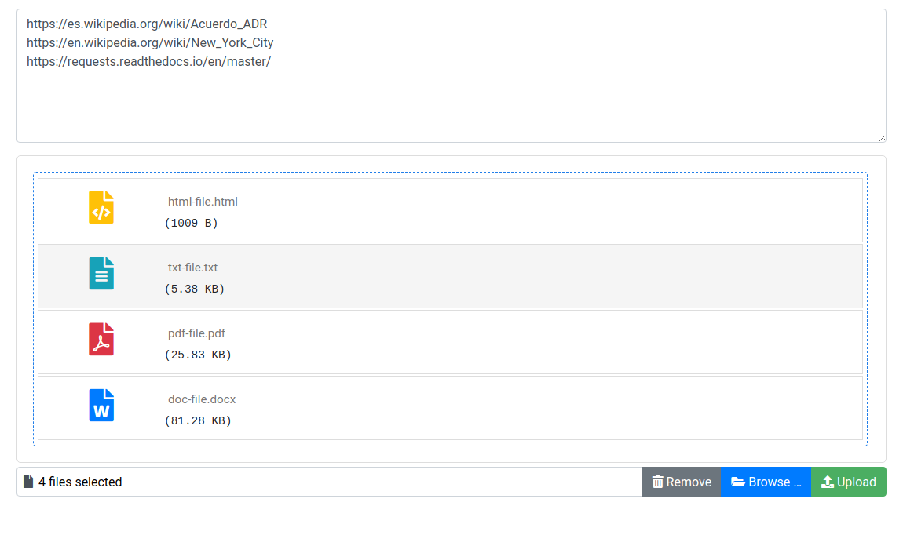

# files-content-parser
Simple web application for text extraction from files and web pages. <br>
Available extensions:
* doc, docx
* pdf
* html, xml, htm, xht
* txt
### Example
<br><br>
User interface was created with bootstrap and [bootstrap-fileinput](http://plugins.krajee.com/file-input) <br>
You can add links to web pages one per line and upload files from your computer. <br>
As output application returns zip archive with all processed files as plain text in .txt extension.
## Usage
### Local run
NOTE: to extract text from .PDF files you must install java server to use [tika](https://github.com/chrismattmann/tika-python)
```bash
sudo apt-get update && apt-get install -y default-jre
```
Launching the application:
```bash
# clone this repository
git clone https://github.com/AlphaCaprice/files-content-parser.git
cd files-content-parser

# create virtual environment and install dependencies
# NOTE: programm works stable on python 3.7
python -m venv .env
source .env/bin/activate
pip install -r requirements.txt

# Launch app
python main.py
```
By default application works on http://localhost:5000

### Run with Docker
```bash
# clone this repository
git clone https://github.com/AlphaCaprice/files-content-parser.git
cd files-content-parser

# build image with docker
docker build . -t files-content-parser 
# run docker container on custom port
docker run -p {your-port}:5000 files-content-parser
```
Application will be available on http://localhost:{your-port}